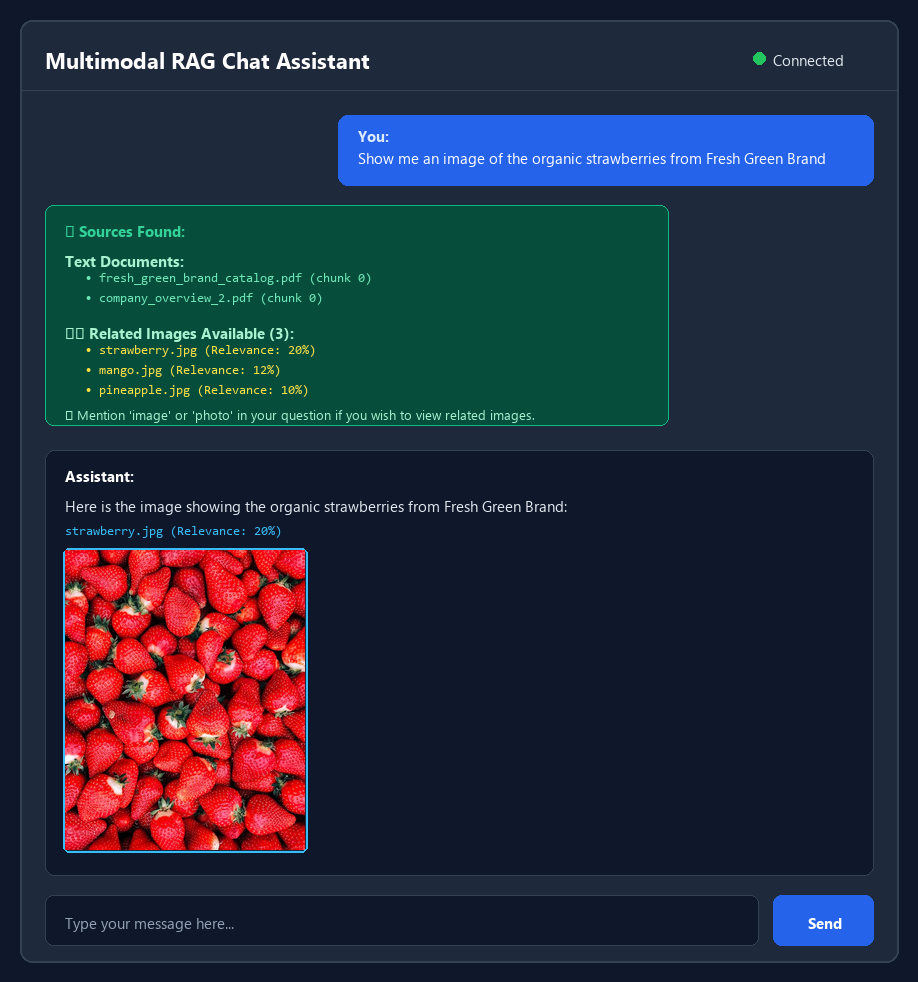
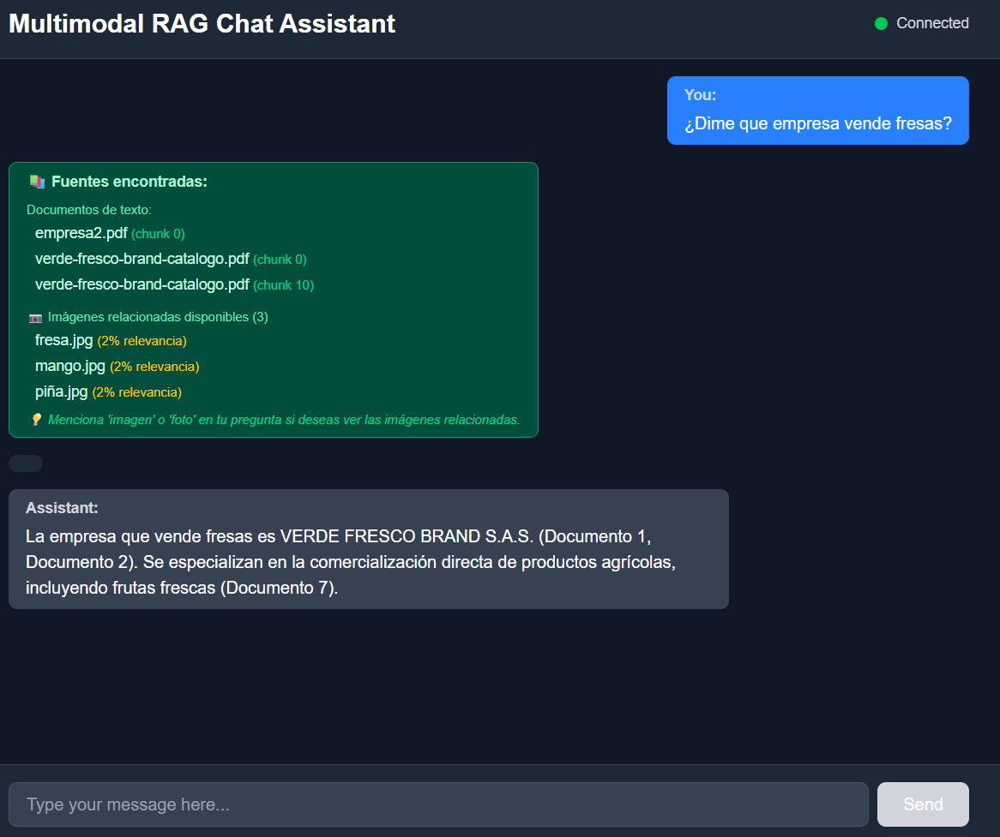

# VisionQuery - FastAPI Multimodal RAG with LangChain & Qdrant


**VisionQuery** is a high-performance Multimodal Retrieval-Augmented Generation (RAG) system built with FastAPI, LangChain, Qdrant vector database, SigLIP 2 vision embeddings, BGE-M3 text embeddings, and Gemini 2.5 Flash.

It supports processing and querying across PDFs, high-resolution images, charts/diagrams, and plain text files with WebSocket streaming and Reciprocal Rank Fusion (RRF) hybrid retrieval.

<p align="center">
  
</p>

<p align="center">
  
</p>

---

## System Architecture

```
PDFs · Images · Charts/Diagrams · .txt
         ↓
Multimodal Extractor (PyMuPDF + PIL)
         ↓                              ↓
Text Chunks                     Images / Crops
(LangChain Splitters)           (base64 + JSON metadata)
         ↓                              ↓
BGE-M3 (Text - 1024 dims)       SigLIP 2 (Vision - 1152 dims)
         ↓                              ↓
Qdrant Collection: text_chunks  Qdrant Collection: image_embeddings
         ↓                              ↓
         └──────── Hybrid Retriever (RRF) ────────┘
                            ↓
               Hybrid Image Search:
               • Visual Search (SigLIP 2 text encoder)
               • Caption Search (BGE-M3 with embedding cache)
               • Weighted RRF Fusion (80% caption + 20% visual)
                            ↓
User Query → FastAPI → Query Encoder → Retriever → Context + Images → Gemini 2.5 Flash → Response
```

## Model Stack

| Component | Model Name | Dimensions | Primary Purpose |
| :--- | :--- | :--- | :--- |
| **Text Embeddings** | BGE-M3 (`BAAI/bge-m3`) | 1024 | Multilingual dense text retrieval |
| **Vision Embeddings** | SigLIP 2 (`google/siglip2-so400m-patch14-384`) | 1152 | Visual & image feature embedding |
| **Image Captioning** | BLIP (`Salesforce/blip-image-captioning-base`) | - | Automatic visual description generation |
| **Multimodal LLM** | Gemini 2.5 Flash | - | Multimodal answer generation |

## Key Features

- ✅ **Multimodal Document Ingestion**: Seamlessly extracts text and embedded images from PDFs, standalone images, and raw text files.
- ✅ **Hybrid Image Search**: Combines SigLIP 2 visual feature matching with BGE-M3 caption vector search using Reciprocal Rank Fusion (RRF).
- ✅ **Cached Caption Embeddings**: Pre-computes caption embeddings in Qdrant for ultra-fast query matching.
- ✅ **Automatic Hardware Acceleration**: Auto-detects NVIDIA CUDA GPUs with half-precision (`fp16`) for maximum throughput.
- ✅ **Real-Time WebSocket Streaming**: Real-time token streaming with automatic image injection when requested.
- ✅ **RESTful API & Interactive UI**: Built-in OpenAPI documentation and WebSocket chat endpoint.

---

## Installation & Setup

### Prerequisites

- **Python 3.11+**
- **Docker** (for Qdrant vector database)
- **NVIDIA GPU** with CUDA support (optional, for faster inference)

---

### 1. Launch Qdrant Vector Database

Download and run Qdrant via Docker:

```powershell
docker pull qdrant/qdrant

# Run Qdrant container with local storage persistence
docker run -d --name qdrant_container -p 6333:6333 -p 6334:6334 -v ${PWD}/qdrant_storage:/qdrant/storage qdrant/qdrant
```

Verify that Qdrant is running by opening: `http://localhost:6333/dashboard`

---

### 2. Environment Configuration

Create a `.env` file in the project root directory with your Google AI Studio API key:

```env
GOOGLE_API_KEY=your_google_api_key_here
QDRANT_HOST=localhost
QDRANT_PORT=6333
```

---

### 3. Install Dependencies

Using [uv](https://docs.astral.sh/uv/) package manager (recommended):

```bash
# Clone the repository
git clone https://github.com/deepakthakur9199/VisionQuery.git
cd VisionQuery

# Sync virtual environment & base dependencies
uv sync

# Optional: Sync with GPU acceleration support
uv sync --extra gpu
```

Or using standard `pip`:

```bash
pip install -r requirements.txt
```

---

## Quick Start & Usage

### 1. Pre-compute Caption Embeddings (Recommended)
Run the script to build and cache caption embeddings for initial images in `filesRAG`:

```bash
uv run python cache_caption_embeddings.py
```

### 2. Start the Backend API Server

```bash
uv run python main_multimodal.py
```

The FastAPI backend server will start at `http://localhost:8000`.
- **API Documentation**: `http://localhost:8000/docs`
- **WebSocket Chat Endpoint**: `ws://localhost:8000/ws/chat`

---

## API Endpoints

| Endpoint | Method | Description |
| :--- | :--- | :--- |
| `/` | `GET` | API root & system capabilities metadata |
| `/api/status` | `GET` | Database collection metrics and file counts |
| `/api/process-files` | `POST` | Trigger ingestion of new files in `filesRAG/` |
| `/api/clear-database` | `DELETE` | Clear all Qdrant vector collections |
| `/ws/chat` | `WebSocket` | Real-time multimodal streaming chat endpoint |

---

## Project Structure

```
visionquery/
├── main_multimodal.py           # FastAPI application server & WebSocket endpoints
├── multimodal_processor.py      # Document processor for PDFs, images, and text
├── image_embeddings.py          # SigLIP 2 vision embeddings & BLIP captioning
├── vector_store_multimodal.py   # Qdrant vector store interface (BGE-M3 + SigLIP 2)
├── hybrid_retriever.py          # RRF Hybrid retriever engine
├── rag_chain_multimodal.py      # Gemini 2.5 Flash multimodal RAG chain
├── cache_caption_embeddings.py  # Utility script to cache caption vectors
├── rebuild_image_collection.py  # Utility script to rebuild Qdrant image collection
├── filesRAG/                    # Knowledge base documents and images directory
│   ├── brandstore/              # Sample brandstore documents & products
│   └── fresh-green-brand/       # Sample organic produce documents & products
├── .env                         # Environment variable configurations
└── pyproject.toml               # Project metadata and dependencies
```

---

## Example Queries

- **Text Knowledge Query**: *"What products does BrandStore offer in its stationery catalog?"*
- **Visual Image Query**: *"Show me an image of the organic Hass avocado."*
- **Multimodal Synthesis Query**: *"What fresh fruits are supplied by Fresh Green Brand and what are their financial highlights?"*

---

## License

This project is open-source and licensed under the **MIT License**.